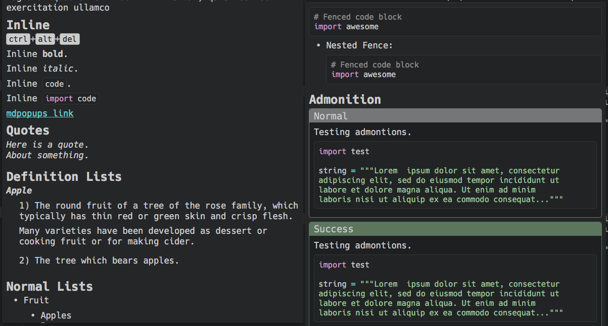

# About Markdown Popups

## Overview

Sublime Markdown Popups (MdPopups) is a library for Sublime Text plugins.  It utilizes the new plugin API found in ST3 Beta to create popups and phantoms from Markdown or HTML. It requires at least ST3 3124+. MdPopups utilizes Python Markdown with a couple of special extensions to convert Markdown to HTML that can be used to create popups and/or phantoms.  It also provides a number of other helpful API commands to aid in creating great popups and phantoms.

MdPopups will use your color scheme to create popups/phantoms that fit your editors look.

## Features

- Can take Markdown or HTML and create nice looking popups and phantoms.
- Dynamically creates popup and phantom themes from your current Sublime color scheme.
- Can create syntax highlighted code blocks easily using your existing Sublime color scheme (can also use Pygments with some setup).
- Can create color preview boxes via API calls.
- A CSS template environment that allows users to override and tweak the overall look of the popups and phantoms to better fit their preferred look.
- Plugins can extend the current CSS to inject plugin specific class styling.
